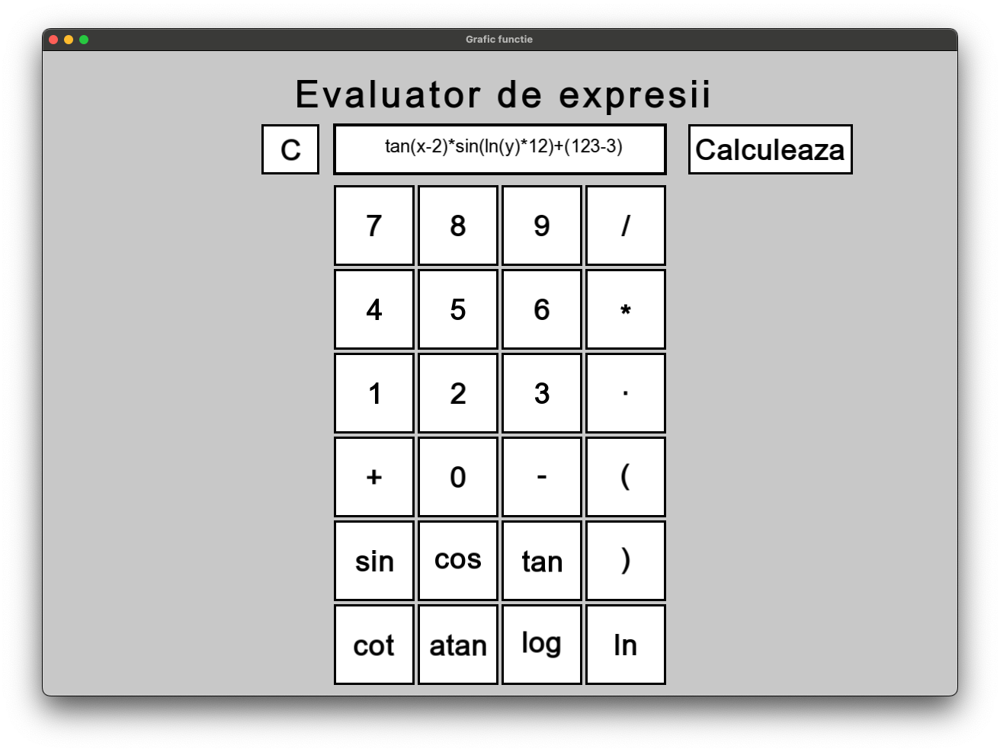
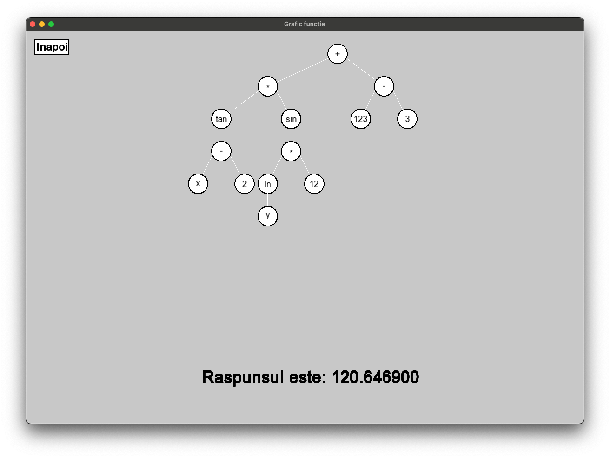

# Expression Parser and Calculator

## Overview

This project is an expression parser and calculator that allows users to input mathematical expressions, visualize the corresponding expression tree, and compute the result. The interface is user-friendly, providing a calculator-like experience for entering expressions.

### Calculator Menu

### Expression Tree

## Features

- **Calculator Interface**: A straightforward interface for entering mathematical expressions.
- **Expression Tree Visualization**: Displays the parsed expression as a tree, making it easier to understand the structure of the expression.
- **Computation of Results**: Evaluates the entered expression and provides the result.
- **Error Checking**: Checks for syntax errors in the entered expression and provides feedback.
- **Variables Support**: Allows defining variables and using them within expressions.

## Usage

1. **Start the Application**: Launch the application to access the calculator interface.
2. **Enter Expression**: Use the calculator interface to input a mathematical expression.
3. **Build Tree**: The application will parse the expression and display the corresponding expression tree.
4. **Get Result**: The application will compute the result of the entered expression and display it.
